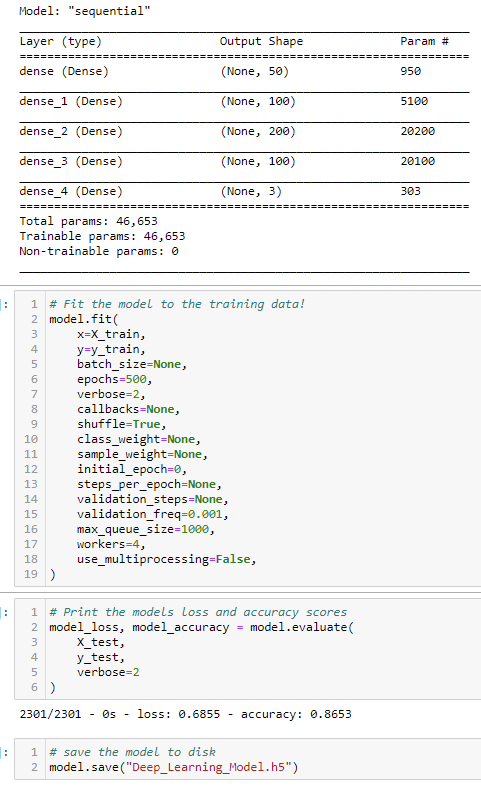
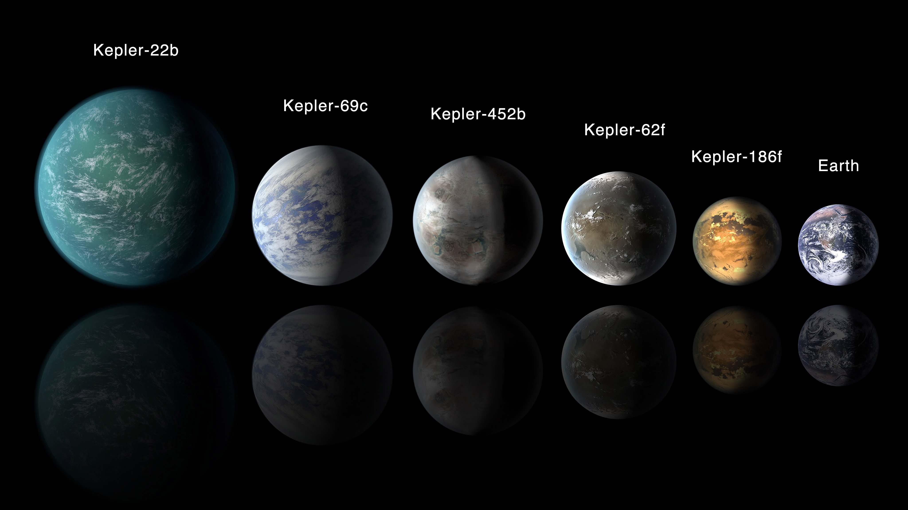

# Exoplanet Exploration

## Purpose
This project was a test to try and create a machine learning model off of real world data. Taking the data and extracting, transforming, and loading the data to use a model to train it on the available features! This was a ton of fun using the scikit learn module!

## Background

Over a period of nine years in deep space, the NASA Kepler space telescope has been out on a planet-hunting mission to discover hidden planets outside of our solar system.

To help process this data, you will create machine learning models capable of classifying candidate exoplanets from the raw dataset.

In this assignment, you will need to:

1. [Preprocess the raw data](#Preprocessing)
2. [Tune the models](#Tune-Model-Parameters)
3. [Compare two or more models](#Evaluate-Model-Performance)

- - -

## Instructions

### Preprocess the Data

* Preprocess the dataset prior to fitting the model.
* Perform feature selection and remove unnecessary features.
* Use `MinMaxScaler` to scale the numerical data.
* Separate the data into training and testing data.

### Tune Model Parameters

* Use `GridSearch` to tune model parameters.
* Tune and compare at least two different classifiers.

### Reporting

* [The Deep Learning model is better than the Logistic Regression model.](https://github.com/uno-sebastian/machine-learning-challenge/blob/main/Deep_Learning_Model.h5)
* The first model I tried was the logistic regression model, using GridSearchCV I went through tons of values. The testing data score turned out to be 80.96% using the best values I found for the settings for the model. Then I used a deep learning model, achieving an accuracy of 86.53%, bringing me to conclude the deep learning model outperforms the logistic regression model.

- - -

## Resources

* [Exoplanet Data Source](https://www.kaggle.com/nasa/kepler-exoplanet-search-results)

* [Scikit-Learn Tutorial Part 1](https://www.youtube.com/watch?v=4PXAztQtoTg)

* [Scikit-Learn Tutorial Part 2](https://www.youtube.com/watch?v=gK43gtGh49o&t=5858s)

* [Grid Search](https://scikit-learn.org/stable/modules/grid_search.html)
